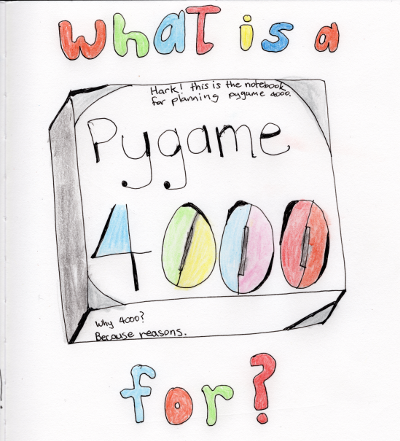

+----------------------------------------------------------------+-----------------+
| What does pygame look like                                     |                 |
| in the year 4000?                                              |                 |
|                                                                |                 |
| Writings and demos by                                          |                 |
| René Dudfield on things                                        |                 |
| he finds interesting.                                          | |pygame4000for| |
|                                                                |                 |
| **Draft/alpha, work in progress.**                             |                 |
|                                                                |                 |
| movies, music, microcode                                       |                 |
|                                                                |                 |
| - `Pixel Perfect Collision Detection <pixel_perfect_>`__       |                 |
| - `SDL2 Fundamentals Tutorial in C <sdl2_basics_>`__           |                 |
| - `Sound Generation and Visualization <sound_generation_>`__   |                 |
| - `Python intro for game programming <python_game_>`__         |                 |
| - `Let's make a shit JavaScript Interpreter! <interpreter_>`__ |                 |
| - `How to port and market games <port_and_market_>`__          |                 |
| - `Let's write a unit test! <unit_test_>`__                    |                 |
| - `Arduino; Serial & pixels for breakfast <arduino_pygame_>`__ |                 |
| - `Awesome pygame <awesome_goodies_for_pygame_>`__             |                 |
+----------------------------------------------------------------+-----------------+

I’m doing a book project! With the aim to cover C, python, and GLSL with pygame and SDL. At the same time covering some topics in pygame and SDL 2 that aren’t covered well by existing resources. Also will cover things like testing, distribution/marketing, multi platform, and CI/CD  which aren’t covered often in game books. A bit of a weird approach I guess. However, I think a comparative approach with a high level language, C for the low level , and GLSL for a GPU language would be very interesting. Only 100ish pages unedited done so far. Trying to use Sphinx and restructured text for it... so it can be read on GitHub and as a PDF. Hopefully an ePub version coming up.

.. _pixel_perfect: docs/pixel_perfect_collision_detection.rst
.. _sdl2_basics: docs/sdl2_basics_tutorial_fundamentals.rst
.. _sound_generation: docs/sound_generation_and_drawing.rst
.. _python_game: docs/python_game_programming.rst
.. _interpreter: docs/interpreter.rst
.. _port_and_market: docs/port_and_market.rst
.. _unit_test: docs/unit_test.rst
.. _port_and_market: docs/port_and_market.rst
.. _arduino_pygame: docs/arduino_pygame.rst
.. _awesome_goodies_for_pygame: docs/awesome_goodies_for_pygame.rst

Combined with the pygame docs, and examples - you're pretty good to go!
Happy hacking!

ps. any suggestions to rene AT pygame.org, thanks for the support!

