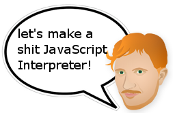

.. contents::
   :depth: 3
..

| |image0|

Let's make a shit javascript interpreter! Part one.
===================================================

| As a learning exercise, I've begun writing a
  `javascript <http://en.wikipedia.org/wiki/JavaScript>`__
  `ECMAScript <http://en.wikipedia.org/wiki/ECMAScript>`__ interpreter
  in
  `python <http://en.wikipedia.org/wiki/Python_%28programming_language%29>`__.
  It doesn't even really exist yet, and when it does it will run really
  slowly, and not support all js features.
| So... let's make a "from scratch", all parsing, all dancing, shit
  interpreter of our very own!
| Teaching something is a great way to learn. Also writing things on my
  blog always gets good 'comments', hints, tips, plenty of heart, and
  outright HATE from people. All useful and entertaining :)

Tokenising
----------

| So to start with, we need something to turn the .js files into a list
  of tokens. This type of program is called a tokeniser.
| From some *javascript* like this:

   ::

      function i_can_has_cheezbrgr () {return 'yum';};

| Into a *Token list* something like this:

   ::

      [
      {"type":"name",
      "value":"function",
      "from":0,
      "to":8},
      {"type":"name",
      "value":"i_can_has_cheezbrgr",
      "from":9,
      "to":28},
      {"type":"operator",
      "value":"(",
      "from":29,
      "to":30},
      {"type":"operator",
      "value":")",
      "from":30,
      "to":31},
      {"type":"operator",
      "value":"{",
      "from":32,
      "to":33},
      {"type":"name",
      "value":"return",
      "from":33,
      "to":39},
      {"type":"string",
      "value":"yum",
      "from":40,
      "to":45},
      {"type":"operator",
      "value":";",
      "from":45,
      "to":46},
      {"type":"operator",
      "value":"}",
      "from":46,
      "to":47},
      {"type":"operator",
      "value":";",
      "from":47,
      "to":48}
      ]

| Wikipedia has a page on
  `Parsing <http://en.wikipedia.org/wiki/Parsing>`__ (also see
  `List_of_unusual_articles <http://en.wikipedia.org/wiki/List_of_unusual_articles>`__
  for some other background information).
| "*Tokenization* is the process of demarcating and possibly classifying
  sections of a string of input characters. The resulting tokens are
  then passed on to some other form of processing. The process can be
  considered a sub-task of
  `parsing <http://en.wikipedia.org/wiki/Parsing>`__ input." --
  `wikipedia
  Lexical_analysis#Token <http://en.wikipedia.org/wiki/Lexical_analysis#Token>`__
  page.

We can has vegetarian cheeseburger... but how can we parse javascript?
~~~~~~~~~~~~~~~~~~~~~~~~~~~~~~~~~~~~~~~~~~~~~~~~~~~~~~~~~~~~~~~~~~~~~~

| To the rescue, comes uncle Crockford the javascript guru of
  `jslint <http://www.jslint.com/>`__ fame. He wrote this lovely
  article: http://javascript.crockford.com/tdop/tdop.html. The ideas
  come from a 1973 paper called `"Top Down Operator
  Precedence" <http://portal.acm.org/citation.cfm?id=512931>`__. The
  Crockford article is great, since it is free, short, and well written
  javascript. Unlike the 1973 paper it gets the ideas from... which is
  behind a paywall, long, and uses a 1973 language called
  `"(l,(i,(s,(p))))" <http://en.wikipedia.org/wiki/Lisp>`__.
| As well as being short and simple... `Phil
  Hassey <http://www.philhassey.com/blog/>`__ used "Top Down Operator
  Precedence" and this article on his journey `making
  tinypy <http://www.philhassey.com/blog/category/tinypy/page/3/>`__.

Goat driven development
~~~~~~~~~~~~~~~~~~~~~~~

|
| |image1|
| Just as Phil did with tinypy, I'm going to use **Goat Driven
  Development**. Well, I'm not even sure what Goat Driven Development
  is... so maybe not.
| Another python using dude, Fredrik Lundh, wrote some articles on
  "`Simple Top-Down Parsing in
  Python <http://effbot.org/zone/simple-top-down-parsing.htm>`__" and
  `Top-Down Operator Precedence
  Parsing <http://effbot.org/zone/tdop-index.htm>`__.
| Also see `Eli Bendersky's
  article <http://eli.thegreenplace.net/2010/01/02/top-down-operator-precedence-parsing/>`__
  on Top Down Operator Precedence.

So where to begin?
~~~~~~~~~~~~~~~~~~

| After reading those articles a few times... scratching my head 13
  times, making 27 hums, a few haaarrrrs, one hrmmmm, and four
  lalalas...
| **light bulb: A brilliant plan!**
| Eli Bendersky implements a full tokeniser, and parser for simple
  expressions like "1 + 2 \* 4".
| Let's copy this approach, but simplify it even more. Our first step is
  to make a tokeniser for a such an expression. That should be easy
  right?

A Token data structure.
~~~~~~~~~~~~~~~~~~~~~~~

| Uncle Doug Crockford uses this structure for a token.

::

   // Produce an array of simple token objects from a string.
   // A simple token object contains these members:
   //      type: 'name', 'string', 'number', 'operator'
   //      value: string or number value of the token
   //      from: index of first character of the token
   //      to: index of the last character + 1

|
| Here's an example token from above:

::

   {"type":"name",
   "value":"i_can_has_cheezbrgr",
   "from":9,
   "to":28}

|

Writing the tokeniser
~~~~~~~~~~~~~~~~~~~~~

| Often a tokeniser is generated... or written by hand.
| `Fredrik
  Lundh <http://effbot.org/zone/simple-top-down-parsing.htm#introducing-the-algorithm>`__
  writes a simple tokeniser using a regular expression.

::

   >>> import re
   >>> program = "1 + 2"
   >>> [(number, operator) for number, operator in
   ...  re.compile("\s*(?:(\d+)|(.))").findall(program)]
   [('1', ''), ('', '+'), ('2', '')]

|
| This is a valid approach... but regexen blow up minds. Instead I'm
  going to write one using a state machine, in a big while loop with
  lots of ifs and elses.

Our homework
~~~~~~~~~~~~

| Write a tokeniser for simple expressions like "1 + 2 \* 4". Output a
  list of tokens like the javascript one does... eg.

::

   {"type":"name",
   "value":"i_can_has_cheezbrgr",
   "from":9,
   "to":28}

|

Until next time...
~~~~~~~~~~~~~~~~~~

Really, I have no idea what I'm doing... but that's never stopped me
before! It's going to be a shit javascript, but it will be **our shit
javascript**.

.. |image1| image:: https://1.bp.blogspot.com/_eJJgehXCsQ4/TCyswPI6joI/AAAAAAAAAH8/RJIShlBAY2M/s1600/goat-driven-development.png
   :width: 251px
   :height: 202px
   :target: http://www.youtube.com/watch?v=5AiS4ZoZhlY
