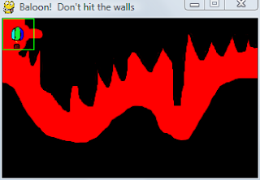
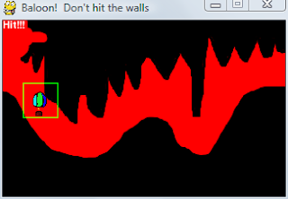

Pixel perfect collision detection in pygame with masks.
=======================================================

| "BULLSHIT! That bullet didn't even hit me!" they cried as the space
  ship starts to play the destruction animation, and Player 1 life
  counter drops by one. Similar cries of BULLSHIT! are heard all over
  the world as thousands of people lose an imaginary life to imperfect
  collision detection every day.

| Do you want random people on the internet to cry bullshit at your
  game? Well do ya punk?

| Bounding boxes are used by many games to detect if two things collide.
  Either a rectangle, a circle, a box or a sphere are used as a crude
  way to check if two things collide. However for many games that just
  isn't enough. Players can see that something didn't collide, so they
  are going to be crying foul if you just use bounding boxes.

| Pygame added fast and easy pixel perfect collision detection. So no
  more bullshit collisions ok?

| Code to go along with this article can be found here (
  https://github.com/illume/pixel_perfect_collision ).

Why rectangles aren't good enough.
----------------------------------

Here are some screen shots of a little balloon game I made modeled after
an old commodore 64 game I typed in when I was eight.  Here you can see
a balloon, and a cave.  The idea is you have to move the baloon through
the cave without hitting the walls.  Now if you used just bounding
rectangle collisions, you will see how it would not work, and how the
game would be no fun - because the rectangle(drawn in green around the
balloon) would hit the sides when the balloon didn't really hit the
sides.

.. container:: separator

   |screenshot_did_not_hit_wall|

|

.. container:: separator

   |screenshot_hit_wall|

|
| You can download the balloon mini game code to have a look at with
  this article.

How is pixel perfect collision detection done? Masks.
-----------------------------------------------------

| Instead of using 8-32bits per pixel, pygames masks use only 1 bit per
  pixel. This makes it very quick to check for collisions. As you can
  compare 32 pixels with one integer compare. Masks use bounding box
  collision first - to speed things up.

| Even though bounding boxes are a crude approximation for collisions,
  they are faster than using bitmasks. So pygame first does a check to
  see if the rectangles collide - then if the rectangles do collide,
  only then does it check to see if the pixels collide.

How to use pixel perfect collision detection in pygame?
-------------------------------------------------------

| There are a couple of ways you can use pixel perfect collision
  detection with pygame.

-  Creating masks from surfaces.
-  Using the pygame.sprite classes.

| You can create a mask from any surfaces with transparency.  So you
  load up your images normally, and then create the masks for them.

| Or you can use the pygame.sprite classes, which handle some of the
  complexity for you.

Mask.from_surface with Alpha transparency.
------------------------------------------

| By default pygame uses either color keys, or per pixel alpha values to
  see which parts of an image are converted into the mask.

| Color keyed images have either 100% transparent or fully visible
  pixels. Where as per pixel alpha images have 255 levels of
  transparency. By default pygame uses 50% transparent pixels as on, or
  ones that are to collide with.

| It's a good idea to pre-calcuate the mask, so you do not need to
  generate it every frame.

Checking if one mask overlaps another mask.
-------------------------------------------

| It is fairly simple to see if one mask overlaps another mask.

| Say we have two masks (a and b), and also a rect for where each of the
  masks is.

::

   #We calculate the offset of the second mask relative to the first mask.
   offset_x = a_rect[0] - b_rect[0]
   offset_y = a_rect[1] - b_rect[1]
   # See if the two masks at the offset are overlapping.
   overlap = a.overlap(b, (offset_x, offset_y))
   if overlap:
       print "the two masks overlap!"

Pixel perfect collision detection with pygame.sprite classes.
-------------------------------------------------------------

| The pygame.sprite classes are a high level way to display your
  images.  They provide things like collision detection, layers, groups
  and lots of other goodies.

| Note: balloon2.py that comes with this article uses sprites with
  masks.

| If you give your sprites a .mask attribute then they can use the built
  in collision detection functions that come with pygame.sprite.

::

   class Balloon(pygame.sprite.Sprite):
       def __init__(self):
           pygame.sprite.Sprite.__init__(self) #call Sprite initializer
           self.image, self.rect = pygame.image.load("balloon.png")
           self.mask = pygame.mask.from_surface(self.image)

   b1 = Balloon()
   b2 = Balloon()

   if pygame.sprite.spritecollide(b1, b2, False, pygame.sprite.collide_mask):
       print "sprites have collided!"

Collision response - approximate collision normal.
--------------------------------------------------

| Once two things collide, what happens next?  Maybe one of these
  things...

| One of the things blows up, disappears, or does a dying animation.
| Both things disappear.
| Both things bounce off each other.

| One thing bounces, the other thing stays. If something going to be
  bouncing, and not just disappearing, then we need to figure out the
  direction the two masks collided.  This direction of collision we will
  call a collision normal.

| Using just the masks, we can not find the exact collision normal, so
  we find an approximation.  Often times in games, we don't need to find
  an exact solution, just something that looks kind of right.

| Using an offset in the x direction, and the y direction, we find the
  difference in overlapped areas between the two masks.  This gives us
  the vector (dx, dy), which we use as the collision normal.

| If you understand vector maths, you can add this normal to the
  velocity of the first moving object, and subtract it from the other
  moving object.

::

   def collision_normal(left_mask, right_mask, left_pos, right_pos):

       def vadd(x, y):
           return [x[0]+y[0],x[1]+y[1]]

       def vsub(x, y):
           return [x[0]-y[0],x[1]-y[1]]

       def vdot(x, y):
           return x[0]*y[0]+x[1]*y[1]

       offset = list(map(int, vsub(left_pos, right_pos)))

       overlap = left_mask.overlap_area(right_mask, offset)

       if overlap == 0:
           return

       """Calculate collision normal"""

       nx = (left_mask.overlap_area(right_mask,(offset[0]+1,offset[1])) -
             left_mask.overlap_area(right_mask,(offset[0]-1,offset[1])))
       ny = (left_mask.overlap_area(right_mask,(offset[0],offset[1]+1)) -
             left_mask.overlap_area(right_mask,(offset[0],offset[1]-1)))
       if nx == 0 and ny == 0:
           """One sprite is inside another"""
           return

       n = [nx, ny]

       return n

Fun uses for masks.
-------------------

| Here's a few fun ideas that you could implement with masks, and pixel
  perfect collision detection.

-  A balloon game, where the bit masks are created from nicely drawn
   levels - which are then turned into bitmasks for pixel perfect
   collision detection.  No need to worry about slicing the level up, or
   manually specifying the collision rectangles, just draw the level and
   create a mask out of it. Here's a screen shot from the balloon code
   that comes with this article:

   .. container:: separator

      |screenshot_did_not_hit_wall|

-  A platform game where the ground is not made out of platforms, so
   much as pixels. So you could have curvy ground, or single pixel
   things the characters could stand on.
-  Mouse cursor hit detection. Turn your mouse cursor into something,
   and rather than have a single pixel hit, instead have the hit be any
   pixel under the mouse cursor.
-  "Worms" style exploding terrain.

