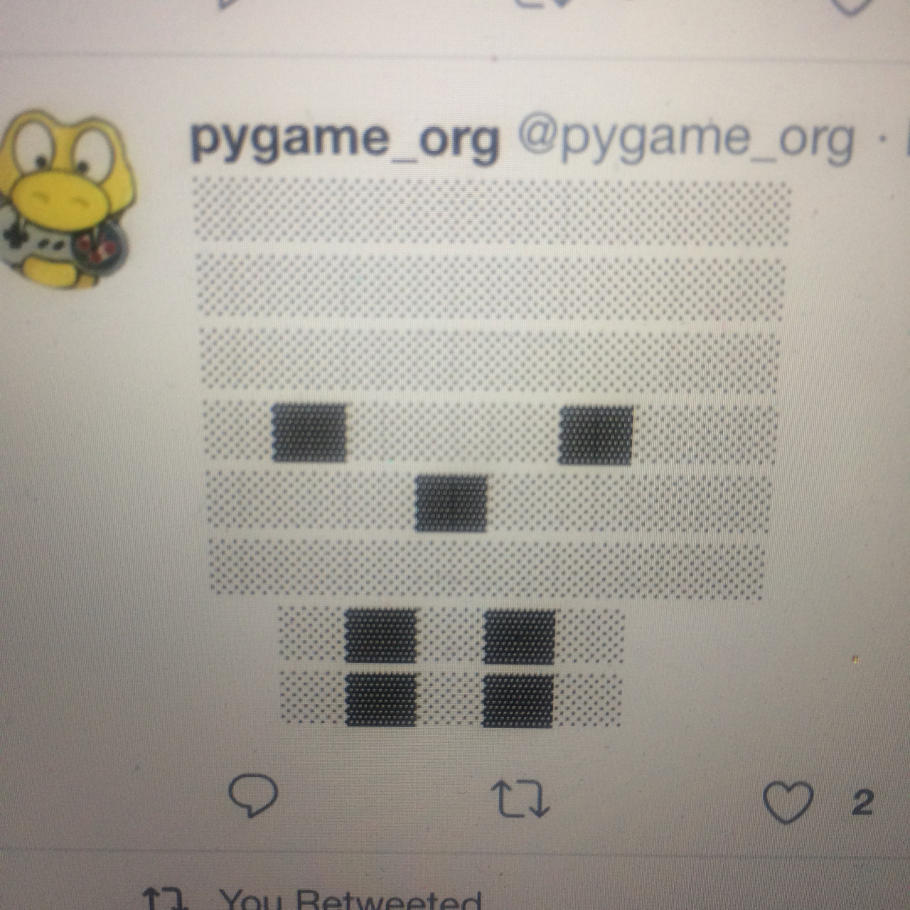
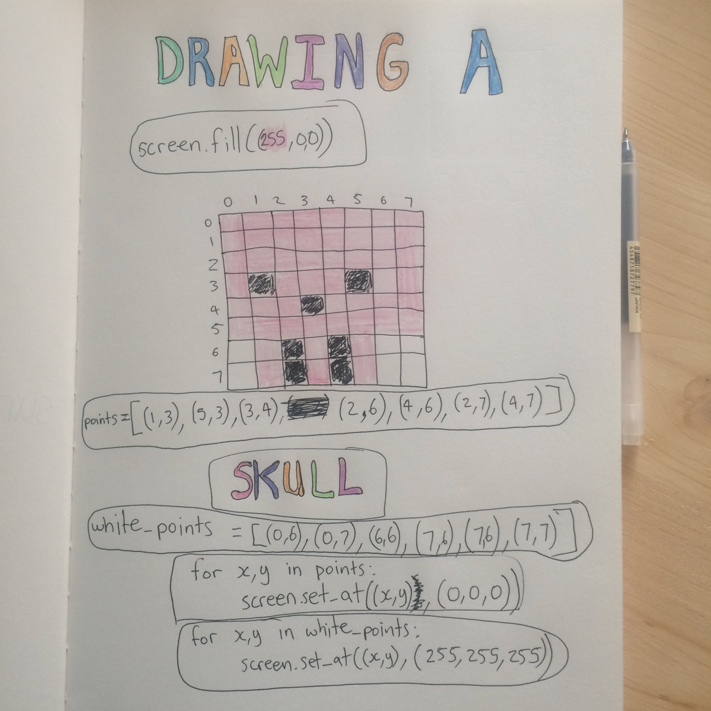
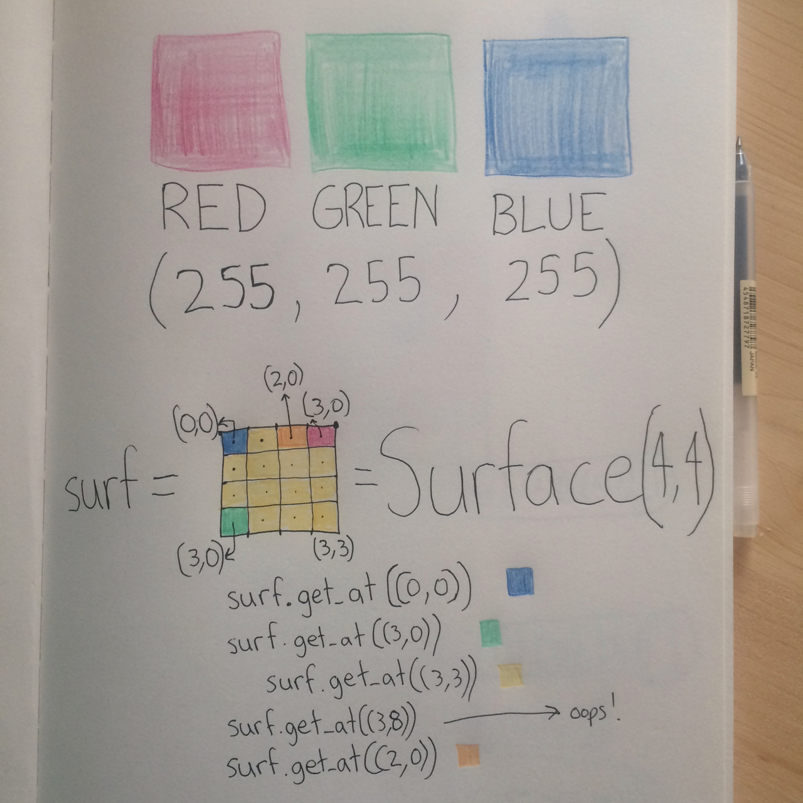

SDL2 basics tutorial fundamentals in C
======================================

Until text comdes, see "../code/hey.c"

This is a sentence.

|surface_color|

This is a sentence2.

|skull_ascii|

This is a sentence3.

|skull_early|
|skull_done|

Some more stuff.

.. |skull_early| image:: images/fundamentals/skull_early.jpg
