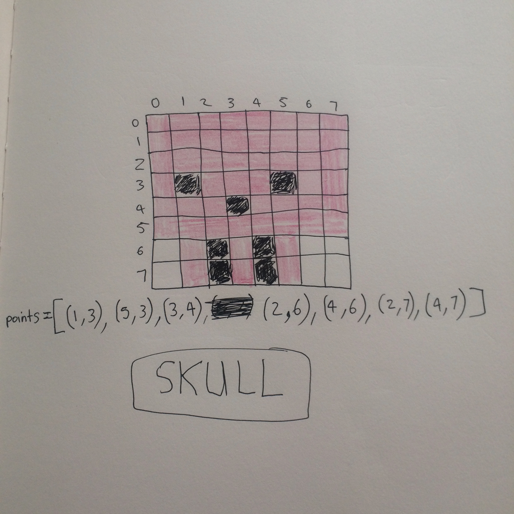

SDL2 basics tutorial fundamentals
=================================

This is a sentence.

|surface_color|

This is a sentence2.

|skull_ascii|

This is a sentence3.

|skull_early|
|skull_done|

Some more stuff.

.. |skull_ascii| image:: images/fundamentals/skull_ascii.jpg
   :scale: 50%
   :width: 100%
   :align: middle

.. |skull_done| image:: images/fundamentals/skull_done.jpg
   :scale: 50%
   :width: 100%
   :align: middle

